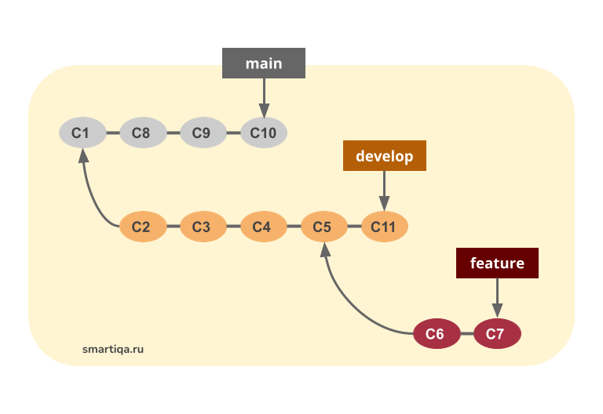

# Инструкция по работе с Git и с GitHub

## Что такое Git
Git - одна из реализации распределенных систем контроля версии, позволяющая организовать версионность, как локально, так и на удаленном сервере. Самая популярная платформа, реализующая *Git*, - [GitHub](http://github.com) 

## Подготовка репозитория
Для создания в папке репозитория необходимо открыть эту папку в терминале и написать команду *git init*, после чего в этой папке создасться скрытая папка *git*, и таким образом папка станет репозиторием. 

$ cd /Users/user/my_project
для Windows:

$ cd C:/Users/user/my_project
а затем выполните команду:

$ git init
Эта команда создаёт в текущем каталоге новый подкаталог с именем .git, содержащий все необходимые файлы репозитория — структуру Git репозитория. На этом этапе ваш проект ещё не находится под версионным контролем. Подробное описание файлов, содержащихся в только что созданном вами каталоге .git, приведено в главе Git изнутри

Если вы хотите добавить под версионный контроль существующие файлы (в отличие от пустого каталога), вам стоит добавить их в индекс и осуществить первый коммит изменений. Добиться этого вы сможете запустив команду git add несколько раз, указав индексируемые файлы, а затем выполнив git commit:

$ git add *.c
$ git add LICENSE
$ git commit -m 'Initial project version'
Мы разберем, что делают эти команды чуть позже. Теперь у вас есть Git-репозиторий с отслеживаемыми файлами и начальным коммитом.

## Создание коммитов 

### Просморт состояния репозитория

### Добавление файла к коммиту
Для того, чтобы добавлять файл к "сохранение", необходимо использовать команду *git add*. В терминале с открытой папкой-репозиторием необходимо *git add <название файла>*, и этот файл доавиться к "сохранению" 

### Создание фиксации
Для создания фиксации используется команда *git commit*. Для этого в терминале с папкой-репозиторием необходимо написать команду *git commit -m <сообщение к комиту>*, Сообщение к комиту писать **ОБЯЗАТЕЛЬНО**

## Журнал изменений

## Перемещение между коммитами

## Ветки git
Для того что бы создавать ветки нужно быть хорошим человеком)
С точки зрения логики, ветка – это последовательность коммитов. Чтобы проще было понять, что такое ветка, рассматривайте ее как некоторую временную шкалу. Коммиты в ней – снимки интересных моментов, идущие друг за другом в хронологической последовательности. Рисунок ниже поможет вам в интуитивном представлении.

### Создание ветки 
Для того что бы создать ветку используется команда *git brance*. Для этого в терминале с папкой - репозиторием необходимо написать *git brance*"название ветки" и таким образом создасться глвая ветка а вы окажитесь в исходной.   

### Слияние веток и решение конфликтов
Ветка – независимая последовательность коммитов. Ветки нужны, чтобы тестировать новые функции и распараллеливать работу над проектом.
Первоначально мы работаем в основной ветке. У нас она называется main.
Обычно в основной ветке находится та же версия кода, что и в продакшене. То есть если в основную ветку попадут какие-то непроверенные изменения, код может сломаться и повлечь за собой поломку приложения у конечного пользователя. Поэтому во всех командах, работающих над серьезными проектами, принято, что в основной ветке находятся только протестированные изменения, которые в идеале не придется экстренно исправлять.

То есть общий ход нашей работы выглядит следующим образом:
1. Решили добавить новую функцию – создали отдельную ветку. Дальше работаем в новой ветке.
2. Написали функцию, протестировали ее работу, внесли все необходимые исправления, еще раз протестировали и убедились, что функция работает исправно и не привнесла ошибок в остальной код.
3. Теперь нужно как-то перенести изменения с тестовой ветки на основную – в продакшн. Тут нам на помощь и приходит слияние: мы просто сливаем (т.е. переносим) изменения с нашей тестовой ветки в основную
Очень часто во время слияния веток оказывается, что ваши изменения удаляют или переписывают информацию в уже существующих файлах. Такая ситуация называется файловым конфликтом. Git останавливает выполнение слияния, пока вы не разрешите конфликт.

### Удаление веток 

### Просмотр спимка веток 
Смотреть ветки очень интересно 
